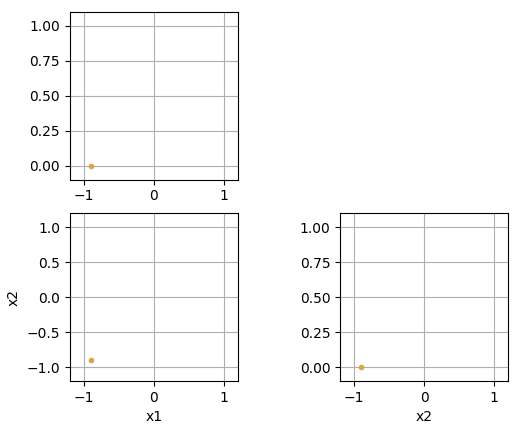
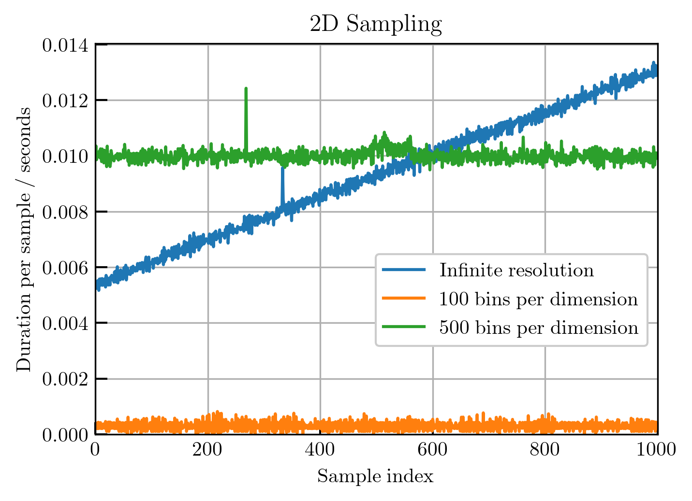
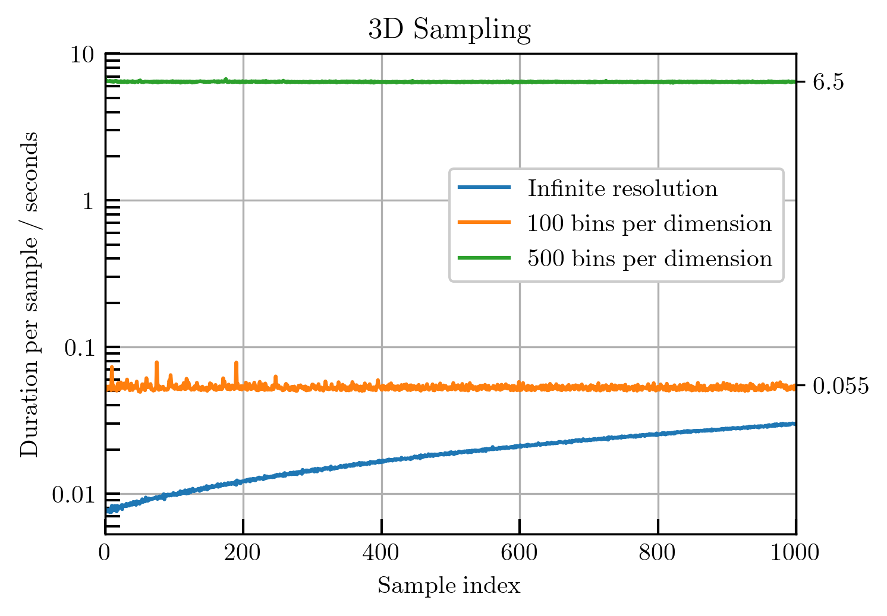

# DESSCA
**D**ensity **E**stimation-based **S**tate-**S**pace **C**overage **A**cceleration

DESSCA is a sampling algorithm whose strategy pursues optimal coverage of a given space. 
Originally, it had been 
[proposed as an exploring starts strategy in reinforcement learning problems](https://arxiv.org/abs/2105.08990)
, i.e., with the intention of initializing the learning environment to a previously unvisited state for higher informational gain.
Over the years, however, DESSCA showed its quality as a universal design of experiments tool, 
which has been utilized for maximized informational gain also when
[collecting data in resource-heavy investigations](https://ieeexplore.ieee.org/abstract/document/9589225)
or for
evaluating and certifying devices under test systematically.

## Citing
An in-depth explanation of the principle, realization and improvement capabilities of DESSCA can be found in the article 
"Improved Exploring Starts by Kernel Density Estimation-Based State-Space Coverage Acceleration in Reinforcement Learning".
Please cite it when using the provided code:

```
@misc{schenke2021improved,
      title={Improved Exploring Starts by Kernel Density Estimation-Based State-Space Coverage Acceleration in Reinforcement Learning}, 
      author={Maximilian Schenke and Oliver Wallscheid},
      year={2021},
      eprint={2105.08990},
      archivePrefix={arXiv},
      primaryClass={cs.LG}
}
```

## Usage

This code snippet serves as a minimal usage example to DESSCA. 
Firstly, install DESSCA:
```
pip install dessca
```
Secondly, import the DesscaModel and create a corresponding object.

```
import numpy as np
from dessca import DesscaModel
my_dessca_instance0 = DesscaModel(box_constraints=[[-1, 1],
                                                   [-1, 1]],
                                  state_names=["x1", "x2"],
                                  bandwidth=0.5)
```

This model instance can be used on a two-dimensional state space.
Now let's make use of its functionality by viewing the state-space coverage of a dataset.
Here are some samples:

```
samples_2d = np.array([[-0.8, -0.8],
                       [ 0.8, -0.8],
                       [-0.8,  0.8],
                       [ 0.0,  0.0]])

my_dessca_instance0.update_coverage_pdf(data=np.transpose(samples_2d))
my_dessca_instance0.plot_scatter()
```

Output:


And a corresponding coverage heatmap


```
my_dessca_instance0.plot_heatmap()
```

Output:


The coverage probability density function (PDF) is updated with the given distribution.
DESSCA can now suggest where to place the next sample.

```
next_sample_suggest = my_dessca_instance0.sample_optimally()
print(next_sample_suggest)
```

Output:
```
[0.85517754 0.94340648]
```
(Note: results are a little random in scenarios with very few samples)

As was to be expected, the suggestion is in the upper right corner of the state space.
Update the coverage density and view the new distribution:

```
my_dessca_instance0.update_coverage_pdf(data=np.transpose([next_sample_suggest]))
my_dessca_instance0.plot_scatter()
```

Output:


Let's have a look at the density:

```
my_dessca_instance0.plot_heatmap()
```

Output:


### More Features
The scatter plots can also be rendered in an online fashion (100 samples):
```
my_dessca_instance1 = DesscaModel(box_constraints=[[-1, 1],
                                                   [-1, 1]],
                                  state_names=["x1", "x2"],
                                  bandwidth=0.1,
                                  render_online=True)

next_sample_suggest = my_dessca_instance1.update_and_sample()
for _ in range(100):
    next_sample_suggest = my_dessca_instance1.update_and_sample(np.transpose([next_sample_suggest]))
```

Output:


Further, we can parameterize a memory buffer to only memorize a limited number of past samples:

```
my_dessca_instance2 = DesscaModel(box_constraints=[[-1, 1],
                                                   [-1, 1]],
                                  state_names=["x1", "x2"],
                                  bandwidth=0.1,
                                  render_online=True,
                                  buffer_size=25)

next_sample_suggest = my_dessca_instance2.update_and_sample()
for _ in range(100):
    next_sample_suggest = my_dessca_instance2.update_and_sample(np.transpose([next_sample_suggest]))
```

Output:


See how forgetting past samples leads to a group of samples in a similar area?
Lastly, we can also choose to use a specific reference coverage density:

```
def reference_coverage(X):
    # for uniform distribution on a given shape the value range of the reference coverage is not important
    x0 = X[0]
    x1 = X[1]
    return np.less(x0**2 + x1**2, 1).astype(float)

my_dessca_instance3 = DesscaModel(box_constraints=[[-1, 1],
                                                   [-1, 1]],
                                  state_names=["x1", "x2"],
                                  bandwidth=0.1,
                                  render_online=True,
                                  reference_pdf=reference_coverage)

next_sample_suggest = my_dessca_instance3.update_and_sample()
for _ in range(100):
    next_sample_suggest = my_dessca_instance3.update_and_sample(np.transpose([next_sample_suggest]))
```

Output:


Unfortunately, the suggestion mechanism based on kernel density estimation gets slower for larger amounts of samples.
For some scenarios, it can hence be feasible to run DESSCA with a finite resolution, wherein computational complexity
is getting decoupled from amount of data (i.e., it does not get slower over time). 
In the next snippet, we define a discrete resolution of 10, which is probably too low to be useful but
visualizes the mechanism very nicely:

```
my_dessca_instance4 = DesscaModel(box_constraints=[[-1, 1],
                                                   [-1, 1]],
                                  state_names=["x1", "x2"],
                                  bandwidth=0.1,
                                  disc_resolution=10,
                                  render_online=True)

next_sample_suggest = my_dessca_instance4.update_and_sample()
for _ in range(100):
    next_sample_suggest = my_dessca_instance4.update_and_sample(np.transpose([next_sample_suggest]))
```

Output:



However, the discretized mode comes at a relatively large base cost and is, hence, only suggested if datasets have grown
beyond a certain range. The following diagrams give a qualitative overview of the computational effort. 
Quantitatively, execution time may of course vary greatly from one machine to another.

  

DESSCA can also be used for downsampling. Let's firstly find a large dataset that we would like to reduce in size:
```
x1_samples = np.random.triangular(-1, 0.75, 1, size=(1000, 1))
x2_samples = np.random.triangular(-1, -0.75, 1, size=(1000, 1))
samples_2d = np.append(x1_samples, x2_samples, axis=1)

my_dessca_instance4 = DesscaModel(box_constraints=[[-1, 1],
                                                   [-1, 1]],
                                  state_names=["x1", "x2"],
                                  bandwidth=0.5)
my_dessca_instance4.update_coverage_pdf(data=np.transpose(samples_2d))
my_dessca_instance4.plot_scatter()
```

Output:


Now, DESSCA can be used to reduce the set down to a specified number of remaining samples while trying to preserve the original distribution:
```
my_dessca_instance5 = DesscaModel(box_constraints=[[-1, 1],
                                                   [-1, 1]],
                                  state_names=["x1", "x2"],
                                  bandwidth=0.5)

my_dessca_instance5.downsample(data=np.transpose(samples_2d), target_size=100)
my_dessca_instance5.plot_scatter()
```

Output:


Comparing the edge distributions, it can be seen that they are still almost the same despite removing 90 % of the dataset's content.
